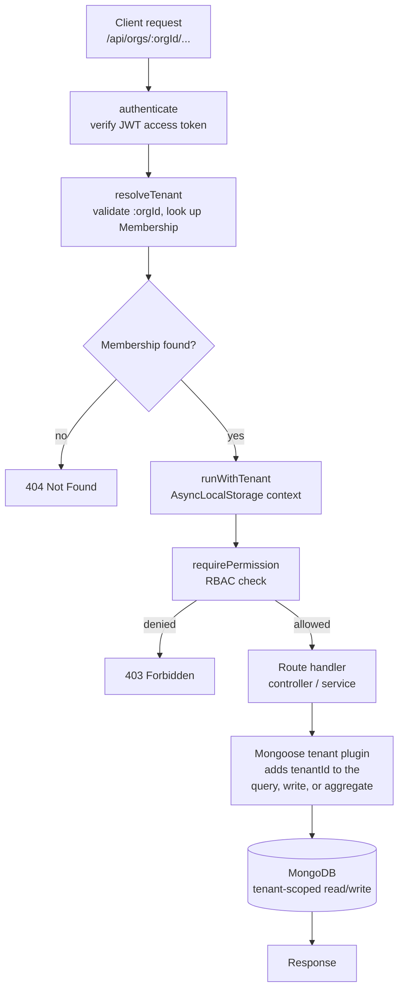

# WorkNest

WorkNest is a multi-tenant project and task manager. Teams sign up as organizations, invite people with roles, and track work in projects and tasks, with limits that depend on the plan they're on. Tenant isolation is handled in one central place, so no query has to remember to filter by `tenantId` on its own.

## Table of Contents

|     | Section                                 |
| --- | --------------------------------------- |
| 01  | [Why I Built This](#why-i-built-this)   |
| 02  | [Tech Stack](#tech-stack)               |
| 03  | [Architecture](#architecture)           |
| 04  | [Request Flow](#request-flow)           |
| 05  | [Tenancy](#tenancy)                     |
| 06  | [RBAC](#rbac)                           |
| 07  | [Concurrency](#concurrency)             |
| 08  | [Features](#features)                   |
| 09  | [Plans](#plans)                         |
| 10  | [API Example](#api-example)             |
| 11  | [Local Setup](#local-setup)             |
| 12  | [Seed Demo Data](#seed-demo-data)       |
| 13  | [Testing](#testing)                     |
| 14  | [Project Structure](#project-structure) |

## Why I Built This

I wanted a project that went further than CRUD and made me deal with the parts of a B2B product that are easy to get wrong. That meant keeping each organization's data apart, checking permissions on the server, handling two people grabbing the last free seat at the same time, and keeping a record of who changed what. WorkNest is built around those four problems.

## Tech Stack

**Backend:** Node.js, TypeScript (strict), Express 5, MongoDB Atlas, Mongoose, Zod, JWT and bcrypt, Socket.IO, Vitest and Supertest

**Frontend:** React 19, Vite, TypeScript (strict), React Router, TanStack Query, React Hook Form with Zod, Axios, Socket.IO client, Tailwind CSS v4, Recharts

## Architecture

### Request Flow

Here's what happens to a request to an org endpoint like `PATCH /api/orgs/:orgId/tasks/:taskId` before it touches the database:



If you aren't a member of an org, you get a 404 whether or not that org exists. From the outside, "not yours" and "doesn't exist" look the same, so the API never tells a stranger that an org is there.

### Tenancy

All organizations share the same database and collections. Each document carries a `tenantId`, and one Mongoose plugin on every org-owned model does the enforcing:

- Query hooks (`find`, `updateOne`, `deleteMany`, `aggregate` and the rest) add the current org's ID to the filter.
- Document hooks stamp `tenantId` on new documents and refuse to save one that belongs to a different org.
- `tenantId` is `immutable` in every schema, so an update can't move a document to another org.
- A query that runs without an org context throws an error instead of quietly returning every org's data, unless it's explicitly marked as cross-org.

The org ID comes from the URL (`/api/orgs/:orgId/...`), gets checked against your membership, and is kept in an `AsyncLocalStorage` context for the rest of the request. That way it doesn't have to be passed through every function by hand.

### RBAC

| Permission                                | admin | manager | member |
| ----------------------------------------- | ----- | ------- | ------ |
| org:read                                  | ✓     | ✓       | ✓      |
| org:update, plan:change                   | ✓     | –       | –      |
| member:read                               | ✓     | ✓       | ✓      |
| member:manage                             | ✓     | –       | –      |
| invite:manage                             | ✓     | –       | –      |
| project:read                              | ✓     | ✓       | ✓      |
| project:write                             | ✓     | ✓       | –      |
| task:read, task:create                    | ✓     | ✓       | ✓      |
| task:update:any, task:delete, task:assign | ✓     | ✓       | –      |
| task:update:own                           | ✓     | ✓       | ✓      |
| task:request-update                       | ✓     | ✓       | –      |
| task:comment                              | ✓     | ✓       | ✓      |
| audit:read                                | ✓     | –       | –      |
| dashboard:read                            | ✓     | ✓       | –      |

Roles and ownership are two separate checks. The role decides whether you can do something at all, and ownership decides whether you can do it to a particular task. A member can edit and move tasks they're assigned to, but can't reassign them, and doesn't see tasks that are only assigned to admins or managers.

An org can never end up without an admin. The check runs as a conditional update inside the same transaction as the role change or removal, so two admins demoting each other at the same moment can't both succeed.

### Concurrency

Seat and project limits are enforced with atomic MongoDB updates (`$expr` conditions) inside transactions. That closes the usual gap between "check if there's room" and "take the spot" when two requests go for the last seat or project slot at once.

## Features

- **Tenant isolation:** one Mongoose plugin scopes every query, write and aggregation to the current org. The current org lives in `AsyncLocalStorage` for the length of the request, and a query with no org context fails instead of leaking data.
- **Accounts:** email must be verified before an account or its first organization is created. Email changes require the current password and confirmation at the new address. Short-lived JWT access tokens (15 minutes) and rotating refresh tokens are used; only hashes of refresh tokens are stored. Reusing an old refresh token signs out that whole chain of sessions. People can delete their own account; it's soft-deleted so the audit history still makes sense, and the email is freed up for a new sign-up.
- **Roles:** admin, manager and member, checked on the server for every request. The UI hides what a role can't use, but the API is what actually says no.
- **Organizations and plans:** Free, Pro and Premium plans with limits on seats, projects and active tasks per project (see [Plans](#plans)). Upgrades are simulated. A downgrade is blocked while current usage is over the smaller plan's limits, and the error says what's over.
- **Invites:** admins get a one-time invite link (only a hash of the token is stored), and a seat is reserved safely even if several invites go out at once. If the person already has an account, the invitation also shows up in their app under the bell and on their organizations page, where they can join or decline. Inviting an email that already has a pending invite offers a fresh link instead of a vague error.
- **Members:** removing someone takes them out of that org only. Their account and other orgs stay as they are, their tasks in that org become unassigned, and they can be invited back later. If it happens while they're using the org, they're sent to their organizations page with a short note.
- **Projects:** cards show active and total task counts. A project appears under Completed when all its tasks are done. Completed, archived, and binned projects do not use an active project slot. Unarchiving or restoring a project with unfinished work, or reopening work in a completed project, uses a slot again. Projects in the Bin can be restored for 30 days before the project and its tasks are permanently deleted.
- **Tasks:** boards with To do, In progress, and Done columns, cursor pagination, and filters for priority, assignee, and "my tasks". Tasks can have several assignees. Status changes are optimistic and roll back if the server rejects them. Each plan limits active tasks per project. Done, archived, and binned tasks do not use that allowance. Reopening or restoring an active task uses it again.
- **Updates and questions:** admins and managers can ask for an update on one task or on a whole project. Assignees can post updates or ask questions, and anyone in the conversation can reply to a specific message. A message goes to all assignees and the creator by default. @mention people to send it only to them, and then only they and the author can reply. People already in a thread hear about new replies, whoever asked a question can mark the reply that answered it, and whoever asked for an update can remind the people who haven't replied (once an hour). Opening the task or the project's updates marks notifications as read, and a notification opens right at its message.
- **Mute:** anyone can mute a busy project or task. Mentions, replies to you, update requests sent to you and reminders about your own tasks still come through.
- **Dashboard:** tasks by status and priority, top assignees, overdue tasks, and plan usage for admins and managers. Project usage shows active projects only. The "Tasks created" chart covers the last 7 to 90 days or all time, grouped by week or month for long spans, and counts days in your own time zone. Chart numbers show on double-click or double-tap, so a stray tap doesn't pop them up.
- **Messages:** anyone in an org can message anyone else in it, one to one or in a group. A chat is only visible to the people in it, and that includes org admins. Messages arrive live over Socket.IO, with typing indicators, online dots, unread counts and "Seen" receipts. You can reply, react with an emoji, @mention people, edit your own message for 10 minutes after sending it, and delete it whenever you like (it leaves a "This message was deleted" note). Group admins can rename the group and add or remove people, and anyone can leave. You can mute a chat (it stays quiet unless someone mentions you), search every chat you're in, and start a meeting from any chat. The tab title and icon show your unread count, and desktop notifications and a soft sound are available if you turn them on. If the live connection drops, the app falls back to refreshing every few seconds.
- **Files in chat:** images and files are uploaded straight from the browser to Cloudinary as private files. There is no public link: the API checks that you are still in the organization and the conversation every time you open one, and the links it hands out stop working after about 10 to 20 minutes. Files are limited to 10 MB, checked on the server as well as in the browser. Drag them onto a chat or paste them, and click a picture to see it larger. The feature switches itself off if Cloudinary isn't set up.
- **Chat history:** admins can choose how long messages are kept (forever by default, or 1 year, 6 months or 90 days). Older messages and their files are deleted automatically once a limit is set.
- **Meetings:** schedule a meeting with a time, agenda, location, a join link (paste one, or create a free Jitsi room) and the people you want there. Only the organizer and the people invited can see it. Meetings can repeat daily, weekly or monthly, and can be linked to a project or a task (the task's Meetings tab and the project's Meetings button show them). Invitees reply Going, Maybe or Can't go, or suggest another time, which the organizer can accept or turn down. People are notified when a meeting is created, changed or cancelled, and get a reminder 15 minutes before it starts. Moving the time asks everyone to reply again. There's an upcoming and past list, a month calendar, a warning when you double-book yourself, "Meet now" for an instant call, and an "Add to calendar" download.
- **When someone leaves:** if a member is removed or leaves an org, they're taken out of its group chats and meeting invites. If they organize upcoming meetings, the admin removing them (or they, when leaving) picks between cancelling those meetings and handing them to someone who stays. One to one chats stay for the other person but can't be continued.
- **Audit log:** every change to orgs, members, invites, projects, tasks and plans is written in the same transaction as the change, so an action that rolls back never leaves an entry behind. The UI shows plain-language rows with filters.
- **Around the app:** light and dark themes, a first-run tour, a "How to use" guide with the full permission table, a mobile-friendly landing page menu, and a "Send feedback" link that opens an email.

## Plans

| Plan    | Seats | Active projects | Active tasks per project |
| ------- | ----- | --------------- | ------------------------ |
| Free    | 5     | 3               | 10                       |
| Pro     | 30    | 25              | 50                       |
| Premium | 100   | 50              | Unlimited                |

Only active projects use a project slot. Completed, archived, and binned projects do not count. If a project becomes active again, it uses a slot and may need to wait until one is free.

Each project also has a separate active-task limit. Done, archived, and binned tasks do not count toward it. Reopening or restoring an active task uses a task slot again.

## API Example

Every error comes back in the same shape, and the `details` array depends on the error code. Here's what you get when you try to downgrade while you're using more than the smaller plan allows:

```
POST /api/orgs/:orgId/plan
{ "plan": "free" }
```

```json
409 Conflict
{
  "error": {
    "code": "PLAN_DOWNGRADE_BLOCKED",
    "message": "Current usage exceeds the limits of the target plan",
    "details": [
      {
        "seatsUsed": 6,
        "projectCount": 4,
        "projectsOverTaskLimit": 1,
        "targetSeatLimit": 5,
        "targetProjectLimit": 3,
        "targetActiveTaskLimit": 10
      }
    ]
  }
}
```

## Local Setup

You'll need Node 24 (see `.nvmrc`) and a MongoDB Atlas cluster. The free M0 tier is fine, since it runs as a replica set and MongoDB transactions need one.

```bash
git clone https://github.com/sprahasingh/WorkNest.git
cd WorkNest
```

**Backend:**

```bash
cd api
npm install
cp .env.example .env   # fill in MONGODB_URI, JWT_ACCESS_SECRET, and email delivery settings
npm run dev            # runs on http://localhost:4000
```

**Frontend** (in a second terminal):

```bash
cd web
npm install
npm run dev             # runs on http://localhost:5173 and proxies /api to localhost:4000
```

Open `http://localhost:5173` and register, or load the demo data first (below).

In development the live connection for Messages goes through the same Vite proxy, so there's nothing extra to set up. For file attachments, add `CLOUDINARY_CLOUD_NAME`, `CLOUDINARY_API_KEY` and `CLOUDINARY_API_SECRET` to `api/.env`. Without them, Messages works but the attach button is hidden. Files are uploaded as private, so no upload preset is needed.

When the frontend is on Vercel, its `/api` rewrite can't carry websockets. Set `VITE_SOCKET_URL` in Vercel to the API's address (for example `https://your-api.onrender.com`) and make sure `CLIENT_ORIGIN` on the API matches your Vercel URL exactly. If `VITE_SOCKET_URL` is left out, Messages still works, it just refreshes every few seconds instead of updating instantly.
New registrations and email changes require verification email delivery. For hosted deployments, configure Brevo in `api/.env` with `BREVO_API_KEY` and `BREVO_FROM` (a sender address verified in Brevo). Alternatively, configure `SMTP_URL` and `SMTP_FROM` for an SMTP provider.

### Seed Demo Data

```bash
cd api
npm run seed
```

This creates two demo organizations. Every account uses the password `password123`.

- **Acme Corp** (Free plan): `admin@acme.demo`, `manager@acme.demo`, `member@acme.demo`
- **Globex Corporation** (Pro plan): `admin@globex.demo`

## Testing

```bash
cd api
npm test          # runs against an in-memory MongoDB replica set
npm run typecheck
npm run lint
```

```bash
cd web
npm run build      # includes a full TypeScript build
npm run lint
```

The backend tests cover:

- tenant isolation, including failing closed when there's no org context
- the full permission table, and which tasks members can see and edit
- seats and project slots under concurrent requests, and the last-admin rule under concurrent demotions
- refresh token rotation and reuse detection
- in-app invitations, declining, duplicate invites, and removing and re-inviting members
- the project bin, restore, permanent delete and the 30-day cleanup
- plan limits, including active tasks per project and blocked downgrades
- dashboard numbers, including time zones
- direct and group chats staying private (even from admins), unread counts, replies, reactions, the 10 minute edit window and deleting
- muting, @mentions and message search
- private chat files: signed links, who can open them, and the server-side size check
- chat retention and the cleanup of old messages
- meeting visibility, RSVPs, rescheduling, cancelling and the reminder before a meeting starts
- repeating meetings (replying to, editing and cancelling one date or all later ones), suggested times, and links to tasks and projects
- what happens to chats and meetings when someone leaves an organization

## Project Structure

```
api/
  src/
    tenancy/        AsyncLocalStorage context, the isolation plugin, tenant resolution middleware
    auth/           authentication middleware, RBAC, ownership checks
    modules/        one folder per area (auth, orgs, members, invites, projects, tasks, notifications, audit, dashboard, chat, meetings)
    realtime/       the Socket.IO server (live messages, typing, who's online)
    models/         one Mongoose schema per collection
    db/             database connection and startup migrations
  tests/            Vitest and Supertest, against mongodb-memory-server
web/
  src/
    auth/           AuthProvider, route guards
    features/       one folder per area, each with its own api, queries and components
    components/     shared UI (layout, modal, help links, error boundary)
    pages/          landing, login, register, invite, organizations and the how-to-use guide
    hooks/          useCan (permission checks), useOrg (current org)
```

## Author

**Spraha Singh** · [GitHub](https://github.com/sprahasingh)
